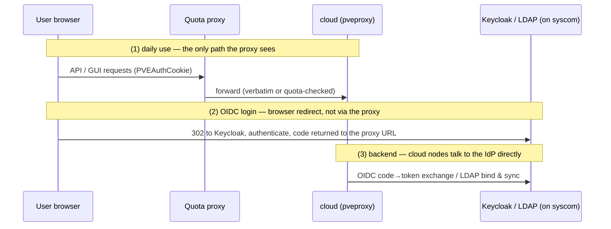

# Architecture

## Background

Proxmox VE has no per-user resource quotas:

- Feature request [Bugzilla #1141](https://bugzilla.proxmox.com/show_bug.cgi?id=1141) has been open since 2016.
- In April 2024 a core PVE developer posted an official RFC ("pool resource limits", 19 patches across 5 repositories) to pve-devel. It went through two review rounds, bit-rotted within 8 months, and remains unmerged as of PVE 9.1 — `/pools` still has no `limits` field.
- PVE's RBAC answers "may this user perform this class of operation?"; it cannot express "…as long as their cumulative allocation stays under X".

All workable solutions in the wild are therefore external, and almost all of them (ProxmoxAAS, cloud portals, hosting panels) replace the GUI with their own. This project deliberately does not: **users keep the native PVE web UI**, and quota enforcement is a transparent reverse proxy in front of the API.

## Approach: Transparent Intercepting Proxy ("Mode A")

```
user browser ──HTTPS──▶ quota proxy ──▶ pveproxy:8006 (entry node) ──▶ cluster-internal proxying
                          │
                          ├─ identity: parse PVEAuthCookie / Authorization header
                          ├─ classify: ~15 resource-mutating write endpoints → quota admission
                          └─ everything else: forwarded verbatim (incl. websockets & uploads)
```

Three facts the design rests on (verified against the PVE 9.1 API schema, 675 endpoints):

1. **Identity is parseable.** `PVEAuthCookie` tickets are plaintext-structured: `PVE:<user@realm>:<hex>::<signature>`. API tokens carry the user id inside the `Authorization` header. The proxy never needs PVE's signing keys — a forged identity is rejected by PVE itself downstream.
2. **Ownership is bindable.** One pool per user; `VM.Allocate` is granted *only* on `/pool/<user's pool>`. PVE's own RBAC then forces every guest the user creates into their pool. The pool is the accounting boundary. See [pool-rbac.md](pool-rbac.md).
3. **The interception surface is small.** Of 675 endpoints, only ~15 writes change resource allocation (create/restore, config update, resize, clone, move-disk/volume, snapshot rollback, storage content allocation, pool membership). All ~340 GETs and unrelated writes pass through untouched, so the native GUI — including noVNC/xterm/SPICE websockets and ISO uploads — keeps working.

## Invariants

1. Users reach PVE only via the proxy; the proxy is transparent to the native GUI.
2. Everything except resource-mutating writes is forwarded verbatim — no rewriting, no buffering.
3. Direct access to `pveproxy:8006` from user networks is blocked at the network layer (the proxy is meaningless otherwise).
4. Fail closed: if a write cannot be quota-evaluated (parser failure, accounting backend down, unknown new endpoint), reject it.

## Two-Cluster Topology

| Cluster | Role | Quota proxy? |
|---|---|---|
| **cloud** | user-facing cluster | yes — all user traffic goes through the proxy |
| **syscom** | infrastructure cluster; hosts LDAP and Keycloak | no |

The identity providers live on syscom, which yields three distinct auth paths — two of them bypass the proxy entirely, by design:



Consequences:

- Keycloak must be reachable from user browsers — it cannot stay syscom-internal-only.
- Every cloud node must reach the IdP and trust its TLS CA (syscom CA root into the Debian trust store).
- Whatever the login method, PVE issues its own `PVEAuthCookie` afterwards — the proxy only ever parses PVE tickets and never talks to the IdP.
- **No circular dependencies:** the proxy's service account lives in a cloud-local realm (`@pve`), never in LDAP/OIDC, so accounting and enforcement survive an IdP outage. Likewise syscom admins keep `root@pam` logins, because syscom hosts the IdP it would otherwise depend on.

See [topology.md](topology.md) for deployment details.

## Concurrency Model

Quota admission is check-then-forward, i.e. a TOCTOU race under concurrency. The upstream RFC (usage broadcast asynchronously via pvestatd, ~10 s period) explicitly concedes the race is unfixable without serializing all usage-affecting tasks cluster-wide. A single proxy instance can do what PVE itself cannot: serialize admission **per user** (cheap; no cross-user contention) and close the race at the single entry point. This is one of the few places where the proxy approach is *stronger* than the native RFC — and it constrains deployment: admission must pass through one logical serialization point (single active proxy; HA as active/passive failover, addressed in P6).

## MVP Scoping

- **Single entry node:** the proxy forwards to one designated cloud node; PVE's built-in cross-node API/console proxying handles fan-out. Multi-upstream and failover are deferred to P6.
- The GUI uses `/api2/extjs/*` (a different error envelope than `/api2/json`), websockets for consoles, and unbuffered multipart uploads — transparency for all of these is the P1 exit gate, before any quota logic is built.
